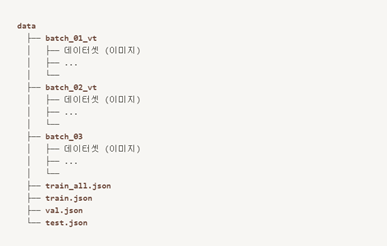

# Ai tech boostcamp 
# P-stage 3-1 (object segmentation)
# 재활용 품목 분류를 위한 Semantic Segmentation


## Directory

```
code
├── README.md
├── __init__.py
├── config.py
├── datasets
│   ├── __init__.py
│   └── data_loader.py
├── docs
│   └── pstage3\ seg\ ?\236??\227\205.pdf
├── imgs
│   ├── img.png
│   ├── img2.png
│   ├── img_1.png
│   ├── img_2.png
│   ├── img_3.png
│   ├── img_6.png
│   └── img_7.png
├── loss
│   ├── __init__.py
│   ├── optimizer.py
│   └── utils.py
├── make_coco_object_alone.py
├── make_coco_sample.ipynb
├── make_coco_search.ipynb
├── make_coco_test.ipynb
├── make_coco_test.py
├── network
│   ├── __init__.py
│   ├── segnet.py
│   └── utils.py
├── object_aug_sample.ipynb
├── submission
│   └── sample_submission.csv
├── test\ history.html
├── train.py
├── train_MPL.py
├── train_MPL_custom.py
├── transforms
│   ├── Augmentations.py
│   └── __init__.py
├── utils
│   ├── __init__.py
│   └── utils.py
└── visualize
    ├── __init__.py
    └── showplots.py
```

### 베이스라인 코드 설명
Segmentation competition의 첫번째 베이스라인의 코드는 VGG를 imagenet data set으로 미리 학습된 weight를 사용하여 구성된 FCN8s model을 바탕으로 작성 되었습니다.

### Components

* ``code/saved``

    * 설명 : ``FCN8s baseline (VGG imageNet weight).ipynb`` 에서 학습된 model (fcn8s_best_model(pretrained).pt)이 저장되는 폴더입니다.

* `code/submission/samplesubmission.csv`

    * 설명 : `code/submission` 는 학습된 model로부터 test set에 대한 예측된 값이 `submission.csv` 로 저장되는 폴더입니다.

    * `sample_submission.csv`는 `submission.csv` 을 생성하기 위해 참고하는 파일

* `code/FCN8s baseline (VGG imageNet weight).ipynb`

    * 설명 : baseline을 notebook 기반으로 작성하였으며, 순차적으로 실행하시면 `submission.csv` 을 생성할 수 있습니다.

* `code/utils.py`

    * 설명 : 평가지표인 mIoU를 계산하는 python script 입니다.

* `code/requirements.txt`

    * 설명 : baseline을 돌리기 위해 필요한 library 들이 기입되어 있습니다.


* `datasets/data_loader.py`
    * 설명 : coco dataset을 불러오는 코드.
    

### How to use?

1. 데이터셋 다운로드

    * data 구성

      

2. 라이브러리 설치

    * 아래의 경로를 확인하여 `code.zip` 압축을 푼 후 `code`폴더를 아래와 같은 위치에 구성해주세요


    * code로 들어가서 아래 명령어를 실행해 필요한 라이브러리를 설치해 줍니다.

    ```
    pip install -r requirements.txt
    ```

3. `code/FCN8s baseline (VGG imageNet weight).ipynb` 실행

    1. 하이퍼파라미터 세팅 및 seed 고정

    2. 학습 데이터 EDA

    3. 데이터 전처리 함수 정의 (Dataset)

    4. Dataset 정의 및 DataLoader 할당

        1. 데이터 샘플 시각화 (Show example image and mask)

    5. baseline model

        1.   FCN8s (VGG imageNet weight)

    6. train, validation, test 함수 정의

    7. 모델 저장 함수 정의

    8. 모델 생성 및 Loss function, Optimizer 정의

    9. 저장된 model 불러오기 (학습된 이후)

    10. submission을 위한 test 함수 정의

    11. submission.csv 생성

4. `code/submission/submission.csv` 제출

## 내가 수정한 / 만든 코드

* `loss/optimizer.py, utils.py`
    * 설명 : optimizer랑 loss 함수를 custom하기 위해 만든 코드.
    
* `network/segnet.py, utils.py`
    * 설명 : 다른 여러 모델을 불러오기 위한 코드.
    
* `transforms/Augmentations.py`
    * 설명 : 여러 augmentation을 적용시키기 위해 만든 코드.
    
* `visualize/showplots.py`
    * 설명 : EDA를 보기 위해 만든 코드.
    
* `config.py`
    * 설명 : 훈련 config을 위한 코드.

* `train_MPL` `train_MPL_custom`
    * 설명 : [meta pseudo label](https://paperswithcode.com/paper/meta-pseudo-labels) 을 하기위한 시도. 잘 되진 않음.
    
* `make_coco_~~~.py, .ipynb`
    * 설명 : 나중에 진행한 object obd 프로젝트에서 object 만 따로 분리한 coco dataset을 만드는 코드.
    

## 실험 기록들
[🧪 P-stage3 seg 실험들 기록](https://htmlpreview.github.io/?https://github.com/bcaitech1/p3-ims-obd-doggum/blob/main/sanggeon_seg/test%20history.html)

## 렙업 레포트
[pstage3 seg 랩업.pdf](https://github.com/bcaitech1/p3-ims-obd-doggum/blob/main/sanggeon_seg/docs/pstage3%20seg%20%EB%9E%A9%EC%97%85.pdf)
